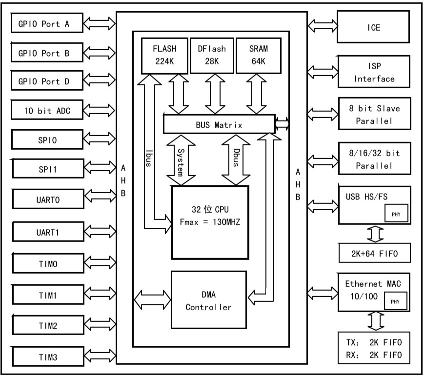

# [CH563](https://github.com/SoCXin/CH563)

#### [Vendor](https://github.com/SoCXin/Vendor)：[WCH](https://github.com/SoCXin/WCH)
#### [Cortex](https://github.com/SoCXin/Cortex)：[ARM9](https://github.com/SoCXin/ARM)
#### [Level](https://github.com/SoCXin/Level)：100/130MHz

### [简介](https://github.com/SoCXin/CH563/wiki)

[CH563](https://github.com/SoCXin/CH563) 是一款32位100MHz ARM9内核MCU，默认系统主频为100MHZ，最高可达130MHZ，224K FLASH、28K DATA FLASH、64K SRAM。

内置100M以太网MAC和PHY，支持10/100M全双工半双工，自动协商，线路自动转换等功能，高度集成的外设以及高性能，可以直接和网络终端如PC，嵌入式设备进行数据交互。

高速USB设备（全功能USB 2.0 ECHI主机），4组定时器、双异步串口、双SPI接口、ADC、唯一ID等。

#### 关键特性

封装：LQFP64M、LQFP128

### [收录资源](https://github.com/SoCXin/CH563)

* [参考文档](docs/)
* [参考资源](src/)
* [参考工程](project/)

### [选型建议](https://github.com/SoCXin)

[CH563](https://github.com/SoCXin/CH563) 集成硬件以太网，拥有大量接口和不俗的性能，适合网络应用场合。

###  [SoC芯平台](http://www.SoC.Xin)
