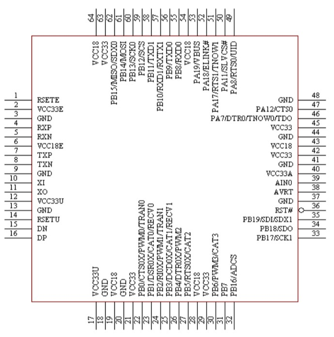

# [CH563](https://github.com/sochub/CH563) 

 

#### [Vendor](https://github.com/sochub/Vendor)：[WCH](https://github.com/sochub/WCH)
#### [Cortex](https://github.com/sochub/Cortex)：[ARM9](https://github.com/sochub/ARM)
#### [Level](https://github.com/sochub/Level)：100/130MHz 

### [CH563简介](https://github.com/sochub/CH563/wiki)

[CH563](https://github.com/sochub/CH563) 是一款32位100MHz ARM9内核MCU，默认系统主频为100MHZ，最高可达130MHZ，224K FLASH、28K DATA FLASH、64K SRAM。

内置100M以太网MAC和PHY，支持10/100M全双工半双工，自动协商，线路自动转换等功能，高度集成的外设以及高性能，可以直接和网络终端如PC，嵌入式设备进行数据交互。

高速USB设备（全功能USB 2.0 ECHI主机），4组定时器、双异步串口、双SPI接口、ADC、唯一ID等。

封装：LQFP64M、LQFP128

### [收录资源](https://github.com/sochub/CH563)

* [参考文档](docs/)
* [参考资源](src/)

### [关联资源](https://github.com/sochub)

* [arm-none-eabi编译器](https://github.com/sochub/arm-none-eabi)

### [选型建议](https://github.com/sochub)

[CH563](https://github.com/sochub/CH563) 集成硬件以太网，拥有大量接口和不俗的性能，适合网络应用场合。

##  [SoC资源平台](http://www.qitas.cn)
